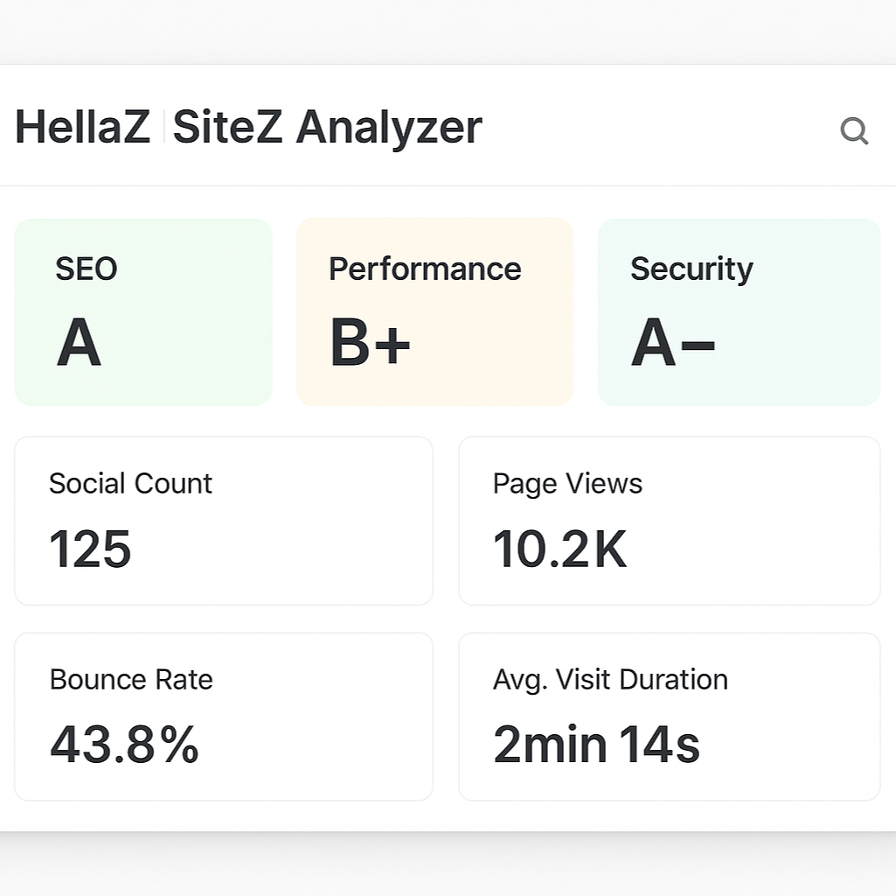

# HellaZ SiteZ Analyzer

A comprehensive WordPress website analysis & metadata plugin that uncovers SEO quality, security, performance, technology stack, social, and contact information from any public URL. Features a multi-section, template-driven UI, advanced caching, bulk analysis, and deep admin controls.

## 🚀 Features

- Extracts full site metadata, Open Graph, Twitter, favicon and feeds
- ✅ **Contact Information Extraction**: email addresses, phone numbers, physical addresses, business hours, detected contact forms, and social contact links
- 🔗 Social media profiling (30+ platforms auto-detected)
- 🌐 Language and structured data analysis (JSON-LD, microdata)
- ⚡ Performance and Core Web Vitals via integrated 3rd-party APIs
- 🔒 Security auditing: HTTPS, headers, VirusTotal, URLScan, and more
- 🏷️ Technology detection (BuiltWith integration)
- 📊 Bulk processing with results database and advanced caching
- 🎨 3 modern, responsive metadata output templates (classic, modern, compact)
- 🛠️ Live template previews and configurable output via WordPress admin
- 🧩 Shortcode, widget, and Gutenberg block integration
- 📋 Admin controls for all API keys, feature toggles, fallbacks, disclaimer, and ALL extraction settings
- 🧪 Optimized for security, performance, and code quality (WordPress Coding Standards)

## 📷 Template Previews

  
  
  

## ⚙️ Installation & Setup

1. Upload and activate the plugin through the WordPress admin area.
2. Navigate to **SiteZ Analyzer > Settings** in the admin menu.
3. Optionally enter API keys for VirusTotal, BuiltWith, and URLScan for enhanced analysis.
4. Configure contact extraction options to specify what info to extract (emails, phones, addresses, forms).
5. Choose your preferred output template: classic, modern, or compact.
6. Adjust caching duration, performance thresholds, security toggles, and disclaimer settings as needed.

## 🚦 Usage

**Shortcode:**  
- Basic analysis:  
  `[hsz_analyzer url="https://example.com"]`  
- Compact view (minimal info):  
  `[hsz_analyzer url="https://example.com" display_type="compact"]`

**Widget:**  
- Add the HellaZ SiteZ Analyzer widget under Appearance → Widgets.  
- Configure URL and display type in widget settings.

**Gutenberg Block:**  
- Add "SiteZ Analyzer" block in the block editor and configure options.

**Templates:**  
- Select the output template globally via plugin settings or override per instance with shortcode parameter.

## 🆕 Changelog

### 2.1.0 — August 2025
- NEW: Contact extraction (emails, phones, addresses, contact forms, operating hours, social links)
- NEW: Contact settings page enables granular control over extraction and validation
- IMPROVED: Unified Analyzer class coordinating all analysis modules
- IMPROVED: Templates updated to display comprehensive contact information elegantly
- IMPROVED: Enhanced admin template selection interface with live previews and detailed guides
- IMPROVED: Multi-API integrations for security, performance, and technology analysis
- FIXED: PHP 8+ compatibility, improved error handling, and input sanitization
- MAINTAINED: Full display of metadata, SEO analysis, social media, feeds, and recommendations

## 🔐 Security & Standards

- All input is sanitized and escaped following WordPress Coding Standards
- Nonce verification on all forms and AJAX endpoints to prevent CSRF
- Caching implemented for performance and API request minimization
- Tested on PHP 7.4 to 8.2 with major WordPress versions

## 🤝 Contributing

Have ideas, bugs, or improvements?  
Feel free to submit issues or pull requests on [GitHub](https://github.com/hellaz/HellaZ-SiteZ-Analyzer).

For support or questions, visit [hellaz.net](https://hellaz.net).

---

